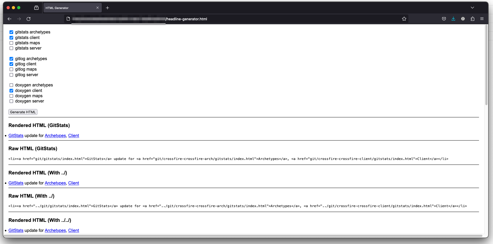

# Crossfire News Headline Generator

## Description

HTML and javascript web page to create Crossfire related news headline html for the home page, news page by year, and current year news page.

## Installation

No special installation requirements other than a web browser with javascript enabled.

### Requirements

A web browser with javascript enabled.

## Usage

The web pages are self contained in that the necessary html elements and javascript are all within the one web page file, so open the file in a browser and it should work

## Screenshot

## Live Web Page

 * [Crossfire home page](https://crossfire.real-time.com/)
 * [Crossfire News page](https://crossfire.real-time.com/news/index.html)
 * [Crossfire Yearly News Archive page](https://crossfire.real-time.com/news/2023/index.html)

## Contributing

 * Contributions are welcome.
 * Pull requests are welcome.
 * Creating a fork on this code base is also welcome.

## Questions

I can be reached via [tannerrj GitHub Profile](https://github.com/tannerrj)

## License:

MIT License

## Crossfire Social Media Links

 * [Facebook](https://www.facebook.com/crossfireproject/)
 * [Mastodon](https://mastodon.social/@crossfiremrpg)
 * [X (Formerly Twitter)](https://twitter.com/crossfiremrpg/)